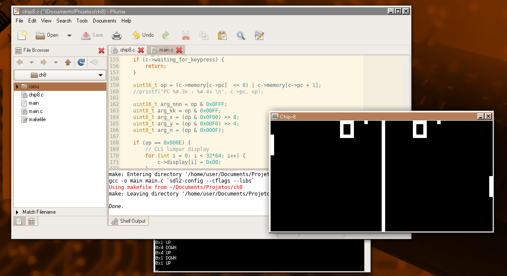

Title: I once created a CHIP-8 console emulator
Description: From JavaScript to C, I dove into the past, creating a CHIP-8 emulator to unlock vintage gaming magic!
Created at: 2023-06-08 10:51

---

[The Chip-8 console](https://en.wikipedia.org/wiki/CHIP-8) is a vintage gaming system designed as a simple platform for running video games.

The console featured a 64x32-pixel monochrome display, a hexadecimal keypad, and built-in sound capabilities.

Suffice to say, it was modest in its hardware capabilities.

In September 2020, after a year of interest in emulators, virtual machines, and fantasy consoles (such as PICO-8), I finally decided to jump head-first into the project. The incentive for the project came from curiosity about how a computer fundamentally works at a low level. I used it to learn C in a more in-depth way -- until then, I only had knowledge in JavaScript/TypeScript.

So here it is!

The emulator passes all the test ROMs for the instruction set and runs all the games tested for CHIP-8.

This is a video I recorded back then, where I was running Pong, Snake and Breakout.

<iframe style="width: 100%; aspect-ratio: 16 / 9" src="https://www.youtube-nocookie.com/embed/noOdbTdtXY4" title="YouTube video player" frameborder="0" allow="accelerometer; autoplay; clipboard-write; encrypted-media; gyroscope; picture-in-picture; web-share" allowfullscreen></iframe>

As always, the [source code is available in my GitHub page](https://github.com/lucas-bortoli/chip8).
